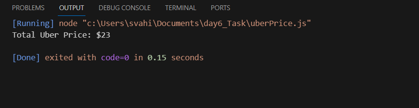

This repository shown the following code output screenshots:

Question 1:

- The class Movie is stated below. An instance of class Movie represents a film. This class has the following three properties:

- title, which is a String representing the title of the movie
- studio, which is a String representing the studio that made the movie
- rating, which is a String representing the rating of the movie (i.e. PG­13, R, etc)

This Output display the movie is under rating  'PG'

Question 2:

Using class to execute the code in javascript:

This output display the circle radius,circle color,area of circle and area of circumference

Question 3:

Write a “person” class to hold all the details.

This output display the person details.

Question 4:

write a class to calculate the Uber price.

This output display the uber price in km rate.

